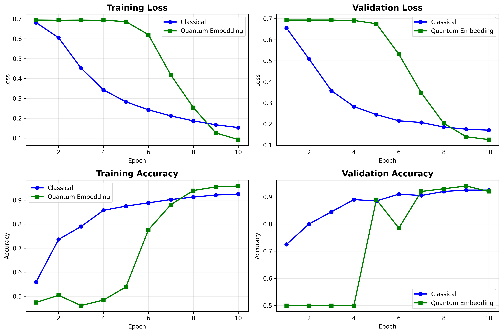

# QuantumAttention

This repository explores a **hybrid quantum\-classical transformer** where classical embedding and attention layers can be replaced with quantum counterparts. The overall architecture follows this high-level flow:

```
Input Tokens → Quantum Embedding → Classical Processing → Quantum Attention → Classical Output
```

Key components include a quantum embedding layer implemented with **parameterized quantum circuits (PQCs)**, a hybrid attention mechanism and standard transformer blocks. The goal is to investigate how quantum features might enrich language models on near term (NISQ) hardware.

## Quantum Embedding Layer

Key design details:

- Qubits required: `n_q = ceil(log2(d_model))`
- Angle encoding and 3\-5 layers of RY/RZ rotations with CNOT entanglement
- Pauli\-Z measurements provide features which are transformed via a small linear layer
- Gradients are computed using the parameter\-shift rule with a shot budget of roughly 1000\-5000

The implementation can be found in [`src/quantum_embedding.py`](src/quantum_embedding.py). The file defines a basic `QuantumEmbedding` and an `OptimizedQuantumEmbedding` that caches quantum evaluations for efficiency.

## Quantum Attention Layer

The quantum attention implementation lives in [`src/quantum_attention.py`](src/quantum_attention.py).

- `QuantumAttention`: single-head SWAP-test-based attention.
- `HybridMultiHeadAttention`: true multi-head wrapper that splits the embedding dimension across heads, runs one quantum head per split, then merges results with an output projection.
- Returned attention weights are averaged across heads for a stable `(seq_len, batch_size, seq_len)` interface.

## Training Comparison

*   `train_compare.py`:
    *   Conducts an experiment comparing a `ClassicalTransformer` against a `HybridQuantumEmbeddingTransformer` on a synthetic sentiment text classification task.
    *   **Key Finding:** The `HybridQuantumEmbeddingTransformer` ultimately achieves **superior performance metrics (notably lower final training and validation loss, and comparable final validation accuracy)** compared to the classical model, when using a similar number of total parameters and identical training hyperparameters.
    *   **Learning Dynamics:**
        *   The classical embedding model converges more rapidly in the initial epochs.
        *   The quantum-enhanced model, while exhibiting slower initial convergence, demonstrates robust learning behavior and surpasses the classical model's loss metrics by the end of training, achieving higher training accuracy.
    *   **Computational Cost:** Training the hybrid quantum model is significantly slower per epoch due to the overhead of quantum circuit simulation.
    *   **Output:** The script generates `quantum_embedding_comparison.png`, visually presenting the loss and accuracy curves for both models, illustrating these dynamics.



## Requirements

Install dependencies with:

```bash
pip install -r requirements.txt
```

Then run the example training:

```bash
python train_quantum_embedding.py
```

This will train both models for a few epochs and save the comparison plot.

## Reproducible Evaluation

Run the full test suite:

```bash
pytest -q
```

Run language-model comparison on a real corpus:

```bash
python train_lm_generation_compare.py --dataset ptb --epochs 2
```

Other dataset options:

- `--dataset wikitext2` (download on first run)
- `--dataset tiny` (offline fallback, fastest)

CI is configured in `.github/workflows/ci.yml` and runs tests on Python 3.10 and 3.11 for pushes and pull requests.

## Latest Performance Snapshot

Last updated: **2026-03-27**

Benchmark command:

```bash
python train_lm_generation_compare.py --dataset tiny --epochs 2 --train_steps 80 --eval_steps 20 --vocab_max 200 --block 4
```

Results from the latest run (CPU):

| Model | Final Train Loss | Final Train PPL | Final Val Loss | Final Val PPL |
| --- | ---: | ---: | ---: | ---: |
| ClassicalTransformerLM | 1.7615 | 5.82 | 1.3648 | 3.91 |
| QuantumEmbeddingTransformerLM | 2.3734 | 10.73 | 2.3569 | 10.56 |

Note: `tiny` is an offline sanity benchmark intended for fast iteration, not a final quality benchmark.
