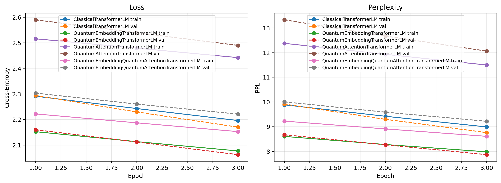

# QuantumAttention

This repository explores a **hybrid quantum\-classical transformer** where classical embedding and attention layers can be replaced with quantum counterparts. The repo now supports multiple interchangeable language-model variants rather than a single fixed pipeline.

```
Input Tokens → {Classical or Quantum Embedding} → {Classical or Quantum Attention} → Classical Output Head
```

Key components include a quantum embedding layer implemented with **parameterized quantum circuits (PQCs)**, a hybrid attention mechanism and standard transformer blocks. The goal is to investigate how quantum features might enrich language models on near term (NISQ) hardware.

## Quantum Embedding Layer

Key design details:

- Qubits required: `n_q = ceil(log2(d_model))`
- Angle encoding and 3\-5 layers of RY/RZ rotations with CNOT entanglement
- Pauli\-Z measurements provide features which are transformed via a small linear layer
- Gradients are computed using the parameter\-shift rule with a shot budget of roughly 1000\-5000

The implementation can be found in [`src/quantum_embedding.py`](src/quantum_embedding.py). The file defines a basic `QuantumEmbedding` and an `OptimizedQuantumEmbedding` that caches quantum evaluations for efficiency.

## Quantum Attention Layer

The quantum attention implementation lives in [`src/quantum_attention.py`](src/quantum_attention.py).

- `QuantumAttention`: single-head attention with two score backends:
  - `swap_test`: PennyLane-backed overlap estimation
  - `fidelity`: fast PyTorch overlap approximation for development and benchmarking
- `HybridMultiHeadAttention`: true multi-head wrapper that splits the embedding dimension across heads, runs one quantum head per split, then merges results with an output projection.
- Supports transformer-style `attn_mask` and `key_padding_mask`, including causal masking for autoregressive language models.
- Returned attention weights are averaged across heads by default for a stable `(seq_len, batch_size, seq_len)` interface.

## Language Model Variants

The language-model stack in [`src/transformer_lm.py`](src/transformer_lm.py) now supports four benchmarkable variants:

- `ClassicalTransformerLM`
- `QuantumEmbeddingTransformerLM`
- `QuantumAttentionTransformerLM`
- `QuantumEmbeddingQuantumAttentionTransformerLM`

This makes it possible to compare embedding-only, attention-only, and fully hybrid quantum variants side by side.

## Training Comparison

*   `train_compare.py`:
    *   Compares `ClassicalTransformer` vs `HybridQuantumEmbeddingTransformer` on a synthetic sentiment classification task.
    *   Generates `quantum_embedding_comparison.png` with train/validation loss and accuracy curves.
    *   Runtime is typically much higher for the quantum-enhanced model due to circuit simulation.
    *   Winner depends on the exact run configuration (data seed, shots, epochs, and model size).

## Requirements

Install dependencies with:

```bash
pip install -r requirements.txt
```

Then run the example training:

```bash
python train_quantum_embedding.py
```

This will train both models for a few epochs and save the comparison plot.

## Reproducible Evaluation

Run the full test suite:

```bash
pytest -q
```

Run language-model comparison on a real corpus:

```bash
python train_lm_generation_compare.py --dataset ptb --epochs 2
```

Run the synthetic classification benchmark with quantum attention:

```bash
python train_quantum_attention_compare.py --epochs 10 --models classical,quantum_embedding,quantum_attention,full_quantum --score_mode fidelity
```

Useful options:

- `--dataset wikitext2` (download on first run)
- `--dataset tiny` (offline fallback, fastest)
- `--models classical,quantum_embedding,quantum_attention,full_quantum`
- `--score_mode fidelity` for the fast benchmark path, or `--score_mode swap_test` for the quantum SWAP-test path
- `--metrics_path artifacts/lm_benchmark_metrics.json` to save structured benchmark output

The LM benchmark harness records:

- train/validation loss and perplexity
- per-epoch timing
- parameter counts
- generations for each selected model
- plot output plus JSON metrics artifacts

The classification benchmark records the same style of plot and JSON metrics for the synthetic sentiment task.

CI is configured in `.github/workflows/ci.yml` and runs tests on Python 3.10 and 3.11 for pushes and pull requests.

## Latest Performance Snapshot

Last updated: **2026-04-02**

Benchmark command:

```bash
python train_lm_generation_compare.py --dataset tiny --epochs 3 --train_steps 80 --eval_steps 20 --vocab_max 200 --block 4 --seed 42 --models classical,quantum_embedding,quantum_attention,full_quantum --score_mode fidelity --plot_path lm_generation_comparison.png --metrics_path artifacts/lm_benchmark_metrics.json
```

Results from the latest run (CPU):

| Model | Final Train Loss | Final Train PPL | Final Val Loss | Final Val PPL |
| --- | ---: | ---: | ---: | ---: |
| ClassicalTransformerLM | 2.1960 | 8.99 | 2.1701 | 8.76 |
| QuantumEmbeddingTransformerLM | 2.0771 | 7.98 | 2.0625 | 7.87 |
| QuantumAttentionTransformerLM | 2.4421 | 11.50 | 2.4899 | 12.06 |
| QuantumEmbeddingQuantumAttentionTransformerLM | 2.1526 | 8.61 | 2.2211 | 9.22 |

Latest benchmark plot (same run as table above):



Note: `tiny` is an offline sanity benchmark intended for fast iteration, not a final quality benchmark.

Consistency rule: whenever metrics are updated, plots must be regenerated from the same run and the README date/command/results must be updated together in one commit.
