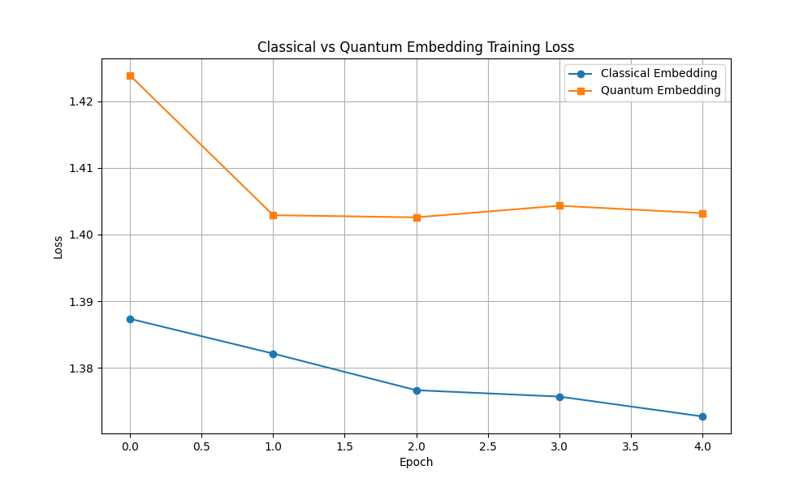

# QuantumAttention

This repository explores a **hybrid quantum\-classical transformer** where classical embedding and attention layers can be replaced with quantum counterparts. The overall architecture is inspired by the plan in `plan.md` and follows the flow:

```
Input Tokens → Quantum Embedding → Classical Processing → Quantum Attention → Classical Output
```

Key components include a quantum embedding layer implemented with **parameterized quantum circuits (PQCs)**, a hybrid attention mechanism and standard transformer blocks. The goal is to investigate how quantum features might enrich language models on near term (NISQ) hardware.

## Quantum Embedding Layer

Relevant details from the plan:

- Qubits required: `n_q = ceil(log2(d_model))`
- Angle encoding and 3\-5 layers of RY/RZ rotations with CNOT entanglement
- Pauli\-Z measurements provide features which are transformed via a small linear layer
- Gradients are computed using the parameter\-shift rule with a shot budget of roughly 1000\-5000

The implementation can be found in [`src/quantum_embedding.py`](src/quantum_embedding.py). The file defines a basic `QuantumEmbedding` and an `OptimizedQuantumEmbedding` that caches quantum evaluations for efficiency.

## Training Comparison

`train_quantum_embedding.py` contains a small experiment comparing a classical embedding against the quantum embedding on a text classification task. Running the script produces `training_comparison.png` which shows the loss curves for both models. At the moment the classical embedding converges faster, but the quantum version also shows clear learning behaviour.



## Requirements

Install dependencies with:

```bash
pip install -r requirements.txt
```

Then run the example training:

```bash
python train_quantum_embedding.py
```

This will train both models for a few epochs and save the comparison plot.
